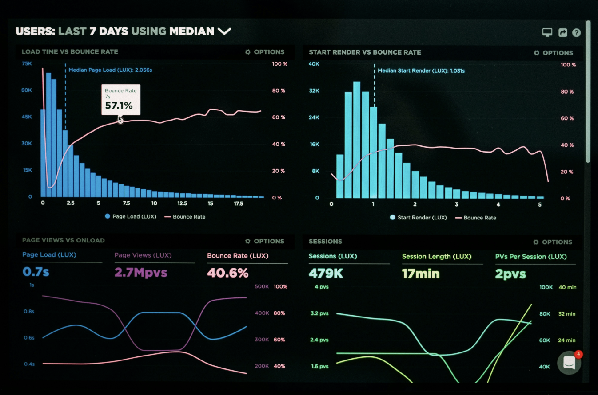
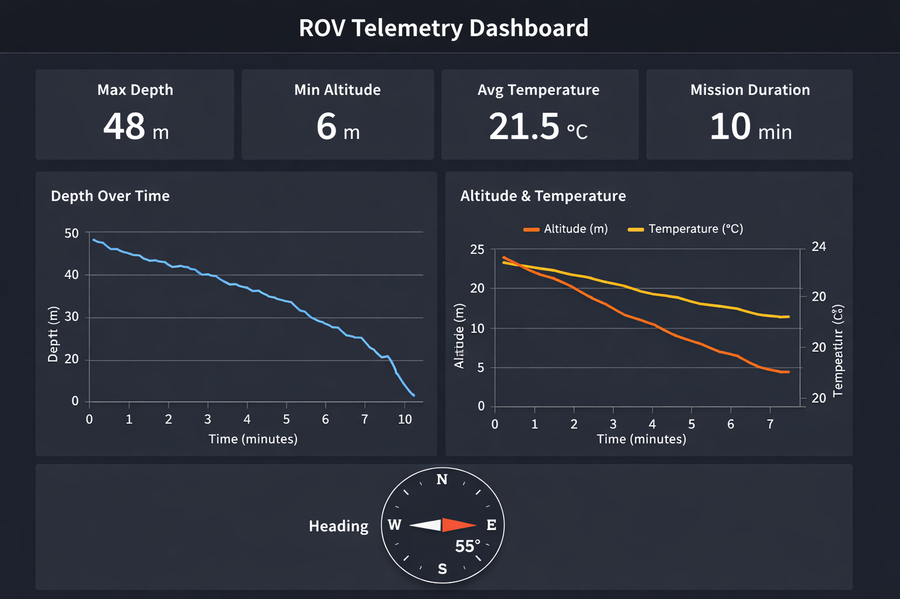

# ROV Telemetry Dashboard

Interactive dashboard for real-time visualization of ROV (Remotely Operated Vehicle) telemetry data, designed to support subsea operations and engineering analysis.

---

## 🧠 Problem

ROV operations generate large volumes of telemetry data (depth, altitude, temperature) that are difficult to interpret quickly during missions.

---

## 💡 Solution

This dashboard transforms raw telemetry data into clear, interactive visualizations, enabling faster decision-making in subsea operations.

---

## ⚙️ Features

- Real-time telemetry visualization
- Depth profile monitoring
- Altitude tracking
- Temperature analysis
- Interactive engineering dashboard

---

## 🖥️ Demo


*(Add a real screenshot here — this is critical)*

---

## 🧰 Tech Stack

- Python
- Streamlit
- Pandas
- Plotly

---

## 📂 Project Structure


rov-telemetry-dashboard/
│
├── app.py
├── requirements.txt
├── README.md
├── data/
│   └── rov_mission_data.csv


---

## ▶️ Run Locally

```bash
git clone https://github.com/igorkiadev-cpu/rov-telemetry-dashboard.git
cd rov-telemetry-dashboard
pip install -r requirements.txt
streamlit run app.py

## Dashboard Preview


