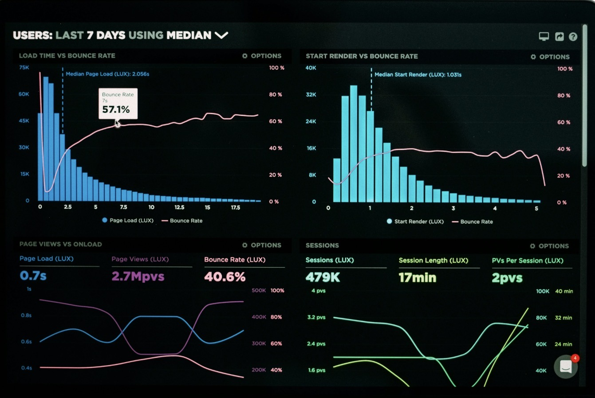

# ROV Telemetry Dashboard

Interactive dashboard for real-time visualization of ROV (Remotely Operated Vehicle) telemetry data, designed to support subsea operations, mission monitoring, and engineering analysis.

Built for engineers and operators who need to quickly interpret large volumes of subsea telemetry during offshore missions.

---

## Overview

ROV missions generate continuous streams of telemetry such as:

- Depth
- Altitude
- Temperature
- Time-series operational data

Interpreting this raw data quickly during subsea operations can be challenging. This project converts raw telemetry into clear, interactive engineering visualizations.

---

## Problem

ROV operations produce large volumes of telemetry data that are difficult to interpret quickly during missions.

Operators often need to monitor:

- Vehicle depth
- Distance to seabed
- Environmental conditions
- Mission behavior over time

Without proper visualization, decision-making becomes slower and more error-prone.

---

## Solution

This dashboard transforms raw telemetry data into interactive charts and engineering insights, enabling faster interpretation during subsea missions.

Key capabilities include:

- Real-time telemetry visualization
- Depth profile monitoring
- Altitude tracking relative to seabed
- Temperature trend analysis
- Interactive mission dashboard

---

## Dashboard Preview

---

## Project Structure

rov-telemetry-dashboard
│
├── app.py
├── requirements.txt
├── README.md
├── images
│   └── dashboard.png
└── data
    └── rov_mission_data.csv

---

## Features

- Interactive telemetry visualization
- Time-series depth monitoring
- Altitude tracking
- Temperature analysis
- Engineering dashboard interface
- Fast data exploration for subsea missions

---

## Tech Stack

- Python
- Pandas
- Streamlit
- Plotly

These tools allow rapid development of interactive engineering dashboards for operational data analysis.

---

## Dataset

Example telemetry dataset includes:

- Timestamp
- Depth
- Altitude
- Temperature

Sample file:

data/rov_mission_data.csv

---

## Installation

Clone the repository:

git clone https://github.com/igorkiadev-cpu/rov-telemetry-dashboard.git

Navigate into the project:

cd rov-telemetry-dashboard

Install dependencies:

pip install -r requirements.txt

Run the dashboard:

streamlit run app.py

---

## Example Use Cases

This tool can support:

- ROV mission monitoring
- Subsea inspection analysis
- Engineering telemetry review
- Offshore operations training
- Data visualization for subsea robotics

---

## Future Improvements

- Live telemetry streaming
- Additional sensor integration
- Mission anomaly detection
- 3D subsea mission visualization
- Cloud deployment

---

## Author

Igor Carvalho

Subsea operations professional transitioning into Data Engineering and Scientific Visualization, with experience in:

- ROV operations
- Subsea inspection
- Engineering data analysis
- Python data visualization

GitHub  
https://github.com/igorkiadev-cpu

---

## License

This project is open source and available under the MIT License.
